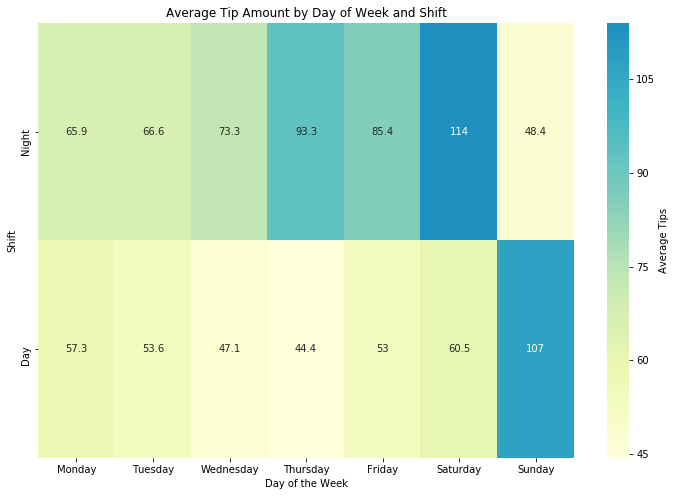

# Server Tips Analysis

## Summary of Analysis

Working as a server my wage is highly dependent on the amount of tips I make on a given shift. Shifts are categorized by the day of the week and whether it was a Day shift or a Night shift. The tip amount varies every shift and generally random depending on the day. In order to help me budget around the variance in my earnings and to optimize my work schedule, I performed an analysis to forecast my weekly tips on Juypter Notebooks.

From this analysis we can conclude that there is a positive correlation between total sales volume and tips earned. The higher the sales volume, the more a server earns on tips. This relationship can be seen below in the linear regression plot


Focusing on volume as our key metric, the most money can be earned working the following shifts.
  - Thursday Night
  - Friday Night
  - Saturday Night
  - Sunday Day

Using Seaborn we visualize our results.




For a more detailed analysis read on below.

## Getting Started

To help me budget and optimize my earning potential as a server, I collected about 6-months worth of data from my daily cash outs after every shift. The main features from the cash outs that I focus on are:
  - Day of the Week
  - Whether I worked a Day Shift, Night Shift, or a Double (Day & Night)
  - Total Tips Received
  - Total Sales for the Day
  - Cash Amount Received for the Day
  - Tips Earned After Tip Out (6% Tip Out to Bar and Kitchen)

The key metric here being the volume of sales done on a given day with the added business value of maximizing my earning potential depending on the Day and Shift.

After extracting the dataset into a CSV file, they are loaded into Python through Juypter Notebook using Pandas.
The CSV files are initially separated into 3 datasets by shift type: [Day](./day_shifts.csv), [Night](./night_shifts.csv) and [Double](./double_shifts.csv).

```Python
day = pd.read_csv('day_shifts.csv')
night = pd.read_csv('night_shifts.csv')
doubles = pd.read_csv('double_shifts.csv')
```

For the full source code, refer to the [Juypter Notebook file](./tips_analysis.ipynb).

## Importing Libraries

For this analysis we utilize 4 Python Libraries for data manipulation, cleaning, and visualization:

```Python
import numpy as np
import pandas as pd
import matplotlib.pyplot as plt
import seaborn as sns
```

## Data Manipulation & Cleaning

After the datasets have been loaded into our workspace, we start by dropping the columns of data we do not need and combining the Day and Night dataset into one master dataset.

```Python
# Dropping columns we do not need
day.drop(['Number of Covers', 'Average Check Amount', 'Total Number of Checks'], axis=1, inplace=True)
night.drop(['Number of Covers', 'Average Check Amount', 'Total Number of Checks'], axis=1, inplace=True)
doubles.drop(['Number of Covers', 'Average Check Amount', 'Total Number of Checks'], axis=1, inplace=True)

# Combine the day and night dataframes into a master dataset
day['Shift'] = 'Day'
night['Shift'] = 'Night'
shifts_worked = day.append(night)
```

Next we need to account for the actual amount a server earns from their tips. The server must tip out 4% of their sales to the kitchen and 2% of their sales to the bartender for a total of 6% of their total sales. We also assume that a customer who pays in cash will also tip in cash. We also assume that someone will generally tip somewhere between 10% to 18%. Using NumPy we randomize the amount of tips received from cash. We append a new column of data for the actual amount of tips earned by the server.
```Python
# Adding a new column of data, My Tips, Amount of tips a server yields after tipping out the kitchen and bar (6%)
# Assuming people who pay in cash tip in cash, randomized between 10 to 18%.
shifts_worked['My Tips'] = round(shifts_worked['Tips'] - (shifts_worked['Sales'] * 0.06) + (shifts_worked['Cash Amount'] * np.random.randint(10,19) / 100), 2)
```

It is important to note that the [Doubles Dataset](./double_shifts.csv) contains the amalgamated values of both the Day and Night shift on a given day. It is not possible to get the segregated data so there is no real way of knowing how much of the total was contributed from the Day shift or the Night shift.

To account for this, we analyze the relationship between the [Day Dataset](./day_shifts.csv) and the [Night Dataset](./night_shifts.csv) to extrapolate for the [Doubles Dataset](./double_shifts.csv) and separating it into its subtotals of Day and Night.

From a quick glance of our data, we can conclude that on average we can expect a higher volume of sales during the Night as opposed to the Day. To put a number on it, we can expect to do about 54% more in sales on a Night shift than a Day shift. To put it into perspective, if we were to combine the total sales on a given day, about 40% of the sales would come from the Day and 60% from the Night.

```Python
# Extrapolating doubles dataset using the Day and Night datasets to split double shifts worked into Day and Night
avg_day_tip = shifts_worked[shifts_worked['Shift'] == 'Day']['My Tips'].values.mean()
avg_night_tip = shifts_worked[shifts_worked['Shift'] == 'Night']['My Tips'].values.mean()
avg_night_tip / avg_day_tip

# On average you can expect to make 54% more on a night shift compared to a day shift
ratio = avg_day_tip / (avg_day_tip + avg_night_tip)
ratio
```

Using the ratio above, we extrapolate and split the [Doubles Dataset](./double_shifts.csv) into the Day subtotal and Night subtotal. We will need to deep copy the original dataset so that we may mutate the data without affecting the original.

```Python
# Split Doubles into Day and Night by using the Ratio above
day_multiplier = np.ones(np.shape(doubles['Tips'])) * ratio
night_multiplier = np.ones(np.shape(doubles['Tips'])) * (1-ratio)
doubles_day = doubles.copy(deep=True)
doubles_night = doubles.copy(deep=True)
```

We apply the multipliers to the copied datasets to create 2 new datasets consisting of the subtotals of the [Doubles Dataset](./double_shifts.csv).

```Python
# Extrapolate new datasets
doubles_day['Tips'] = round(doubles_day['Tips'] * day_multiplier, 2)
doubles_day['Cash Amount'] = round(doubles_day['Cash Amount'] * day_multiplier, 2)
doubles_day['Sales'] = round(doubles_day['Sales'] * day_multiplier, 2)
doubles_day['My Tips'] = round(doubles_day['My Tips'] * day_multiplier, 2)
doubles_night['Tips'] = round(doubles_night['Tips'] * night_multiplier, 2)
doubles_night['Cash Amount'] = round(doubles_night['Cash Amount'] * night_multiplier, 2)
doubles_night['Sales'] = round(doubles_night['Sales'] * night_multiplier, 2)
doubles_night['My Tips'] = round(doubles_night['My Tips'] * night_multiplier, 2)
doubles_day['Shift'] = 'Day'
doubles_night['Shift'] = 'Night'
```

We will then append the new datasets into our master dataset to give us the final dataset.

Next we clean our data for readability and analysis.
In order to categorize and sort the dataset by the Day of the Week, we map the numerical value of 0 to 6 to Monday to Sunday.

```Python
# Sorting dataset by Shift and Day
days_transform = {'Monday':0, 'Tuesday':1, 'Wednesday':2, 'Thursday':3, 'Friday':4, 'Saturday':5, 'Sunday':6}
days_reverse = {0:'Monday', 1:'Tuesday', 2:'Wednesday', 3:'Thursday', 4:'Friday', 5:'Saturday', 6:'Sunday'}
# Map Categorical column Day to numerical for sorting
shifts_worked['Days Sort'] = shifts_worked.Day.map(days_transform)
shifts_worked.sort_values(['Shift', 'Days Sort'], inplace=True)
```

## Data Visualization and Analysis

Initially we assumed that a higher volume of sales would yield in higher earnings from tips. To justify this claim we go ahead and visualize our master dataset and fit a linear regression. Using the polyfit method from NumPy, we are able to fit a slope and intercept value of the Sales in relation to Tip Amount. Using the linear algebraic capabilities of NumPy we can fit and generate the following figure below:


```Python
# Using NumPy and its linear algebra functions to fit a linear regression line of our data
mb = np.polyfit(shifts_worked['Sales'], shifts_worked['My Tips'], deg=1)
x = np.append(shifts_worked['Sales'].values.reshape(-1,1), np.ones(np.shape(shifts_worked['Sales'].values.reshape(-1,1))), axis=1)
y_pred = np.dot(x, mb)
# Visualizing the linear regression relationship between Average Sales Volume and Tips Received using Seaborn
plt.figure(figsize=(14,7))
sns.scatterplot(y='My Tips', x='Sales', hue='Shift', data=shifts_worked)
sns.lineplot(x='Sales', y=y_pred, data=shifts_worked, color='r')
plt.xlabel('Average Sales Volume')
plt.ylabel('My Tips')
plt.title('Linear Regression - My Tips vs. Average Sales')
```

From the linear regression plot, we can see that the Sales Volume and the Tip Amount are positively correlated, and that a higher Sales Volume will yield a higher earnings from tips.

Once we have established the relationship between sales and tips, we want to see a distribution of sales by the Day of the Week. To do this we must transform our dataset and use the group by method aggregating it by count and mean.

```Python
# Group and Aggregate data for bar plot, by count and average
plot_data = shifts_worked.groupby(['Day', 'Shift']).agg({'Tips':'count', 'Sales':'mean', 'Days Sort':'mean', 'My Tips':'mean'}).sort_values('Days Sort').reset_index()
plot_data
```

Next we see the distribution of sales by Day and Shift.


Next we see the distribution of the frequency of days worked by Day and Shift.


In the optimal case, the Frequency Distribution will mirror the Volume Distribution. Looking at the figures above we can conclude that there is a potential loss in earnings and room for optimization in schedule.

An easier way to visualize this data is through a heatmap. To do this, we need to first transform our data using the pivot method in Pandas.

```Python
# Transform and pivot our data to fit into a heatmap on Seaborn
pivoted = pd.pivot_table(shifts_worked, index=['Shift'], columns=['Days Sort', 'Day'], values=['My Tips'])
pivoted.sort_index(ascending=False, inplace=True)
pivoted.fillna(pivoted.iloc[1,:].mean(), inplace=True)
pivoted
```

As we have no data for Saturday - Day shifts, we use the fillna method on Pandas taking the average of all the Day shifts to fill in for the NaN value.
Using the pivoted dataset, we get the following figure using Seaborn.

```Python
# Visualizing our Average tips earned by Day of the Week and Shift using Seaborn
plt.figure(figsize=(12,8))
ax = sns.heatmap(pivoted, annot=True, cmap='YlGnBu', fmt='.3g', center=100, xticklabels=['Monday', 'Tuesday', 'Wednesday', 'Thursday', 'Friday', 'Saturday', 'Sunday'], cbar_kws={'label': 'Average Tips'})
ax.set(xlabel='Day of the Week', ylabel='Shift', title='Average Tip Amount by Day of Week and Shift')
```


From the heatmap we can see that most money can be made working on Thursday Night, Friday Night, Saturday Night, and Sunday Day.

## Concluding Thoughts

From examining the cash out data, we can draw a few insights about maximizing my earning potential.

  - The higher volume of sales correlates to a higher earnings from tips.
  - More money can be made on a Night shift than a Day shift, with Sunday being the only exception.
  - There is room for optimization in my schedule to maximize earnings.
  - To maximize earnings, we will want to work on Thursday Night, Friday Night, Saturday Night, and Sunday Day every week.
